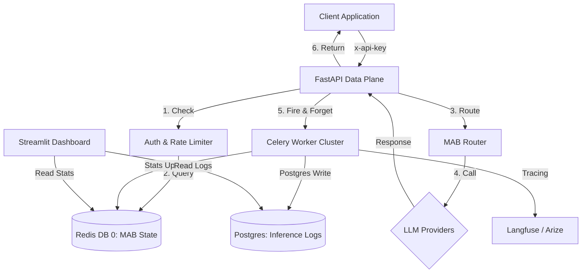

# TINAI: Adaptive AI Routing & Reliability Engine

TINAI is a high-performance, SLA-aware routing gateway for LLM providers, **engineered to handle 1M+ requests per day** with bursts of 100–500 RPS. It uses a **Multi-Armed Bandit (MAB)** algorithm to dynamically route requests across multiple providers based on real-time latency, cost, availability, and quality signals (leveraging **Langfuse** asynchronously for external evaluation).

## 🏗️ Architecture



## 🚀 Quick Start

### 1. Prerequisites
- Docker & Docker Compose
- API Keys for Groq and OpenRouter

### 2. Launch Stack
```powershell
# Start all services (api, worker, beat, redis, postgres, dashboard)
docker-compose up -d --build
```

### 3. Initialize Database
```powershell
# Run Alembic migrations
docker-compose exec api alembic upgrade head
```

### 4. Generate Test Traffic
```powershell
# Use k6 to simulate load
k6 run tests/k6/saturation.js or k6 run tests/k6/primer.js
```

## ⚙️ Configuration (.env)

| Variable | Description | Default |
|----------|-------------|---------|
| `ENVIRONMENT` | `dev` (docs enabled) or `prod` (docs disabled) | `dev` |
| `X_API_KEY_SECRET` | Secret key for `x-api-key` header | (Required) |
| `DATABASE_URL` | Asyncpg DSN for Postgres | (Required) |
| `REDIS_URL_MAB` | Redis DSN for MAB state (DB 0) | `redis://redis:6379/0` |
| `REDIS_URL_CELERY` | Redis DSN for Celery Broker (DB 1) | `redis://redis:6379/1` |
| `MAB_ALPHA` | Quality Weight (α) | `1.0` |
| `MAB_BETA` | Latency Weight (β) | `0.5` |
| `MAB_GAMMA` | Cost Weight (γ) | `0.5` |
| `LLM_TIMEOUT_SECONDS` | Hard TTFB SLA | `1.5` |

## 🛡️ Security Hardening (Phase 8.1)
- **Sliding-Window Rate Limiting**: Mathematically precise traffic governance via Redis Lua.
- **CORS Lockdown**: Restricted to trusted Streamlit origins.
- **Secure Headers**: `X-Content-Type-Options: nosniff`, `X-Frame-Options: DENY`, `HSTS`.
- **Resource Protection**: Pydantic `max_length` validation on all input fields.
- **Secret Masking**: No raw keys are ever logged or included in telemetry.

## 📊 Observability
- **Real-time Health**: Streamlit dashboard at `http://localhost:8501`.
- **Tracing**: Full request ID propagation to Langfuse.
- **Inference Logs**: Durable Postgres store for historical analysis.
